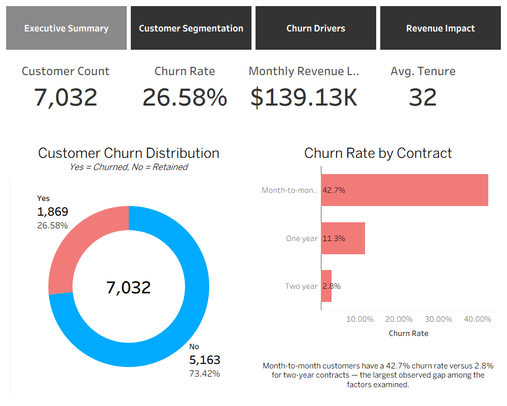
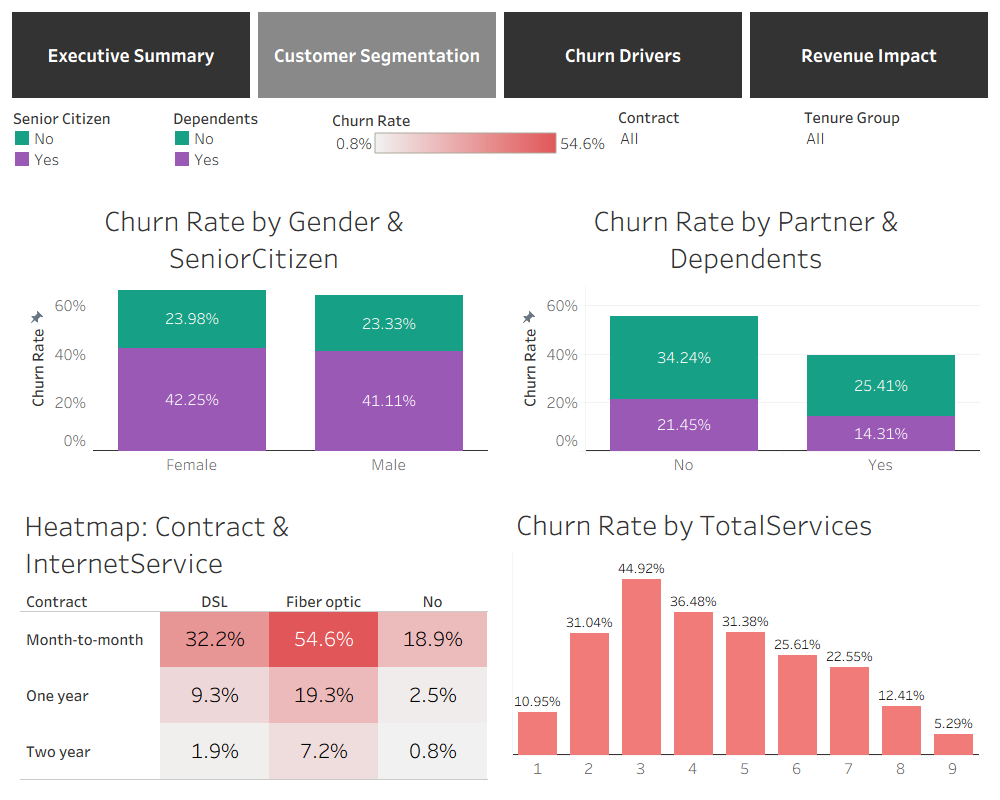
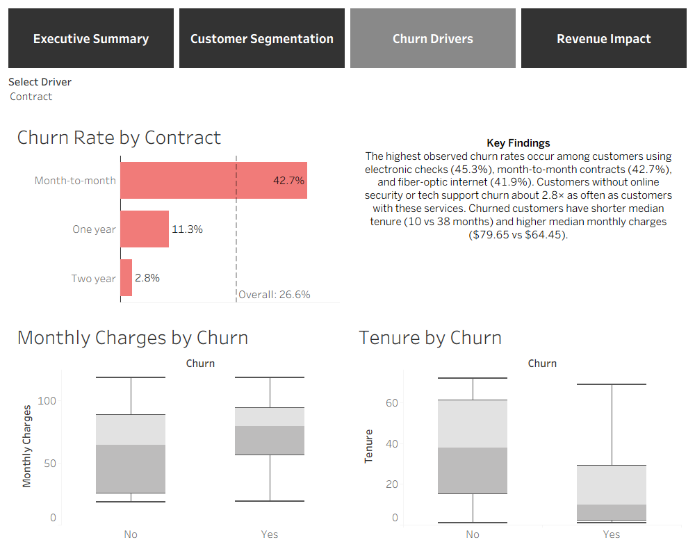
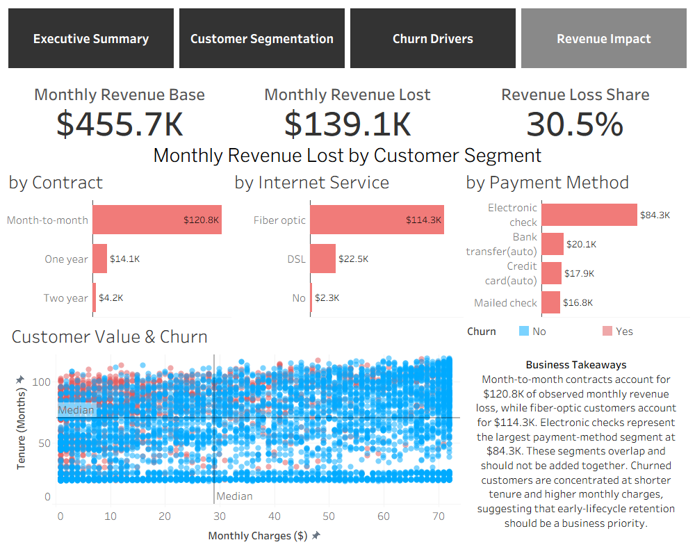

# Telco Customer Churn Analysis

End-to-end customer churn analysis using **Python, SQL, and Tableau**. The project transforms raw telecom customer data into an interactive four-page dashboard focused on customer segmentation, churn patterns, and observed monthly revenue loss.

[](https://public.tableau.com/app/profile/vadym.korolevych/viz/telco-customer-churn-dashboard/ExecutiveSummary)


> **[Explore the interactive dashboard on Tableau Public](https://public.tableau.com/app/profile/vadym.korolevych/viz/telco-customer-churn-dashboard/ExecutiveSummary)**



## Project Overview

Customer churn directly affects recurring revenue and long-term customer value. This project examines a telecom customer dataset to answer four business questions:

1. How large is the churn problem?
2. Which customer segments show the highest churn rates?
3. Which customer attributes are most strongly associated with churn?
4. How much observed monthly revenue is linked to customers who churned?

The analysis follows a complete workflow:

- **Python:** data quality checks, cleaning, feature engineering, and exploratory analysis
- **SQL:** KPI calculation, customer segmentation, and revenue-impact analysis
- **Tableau:** four interactive dashboards designed for business users

## Key Metrics

| Metric | Result |
|---|---:|
| Customers analyzed | 7,032 |
| Churned customers | 1,869 |
| Overall churn rate | 26.58% |
| Monthly revenue base | $455,661.00 |
| Observed monthly revenue lost | $139,130.85 |
| Revenue loss share | 30.53% |
| Average tenure | 32 months |

`Monthly Revenue Lost` is defined as the sum of monthly charges for customers whose churn status is `Yes`. It is an observed snapshot metric, not a forecast of future churn.

## Key Findings

- **Contract type shows the largest observed churn-rate gap.** Month-to-month customers have a 42.7% churn rate, compared with 11.3% for one-year and 2.8% for two-year contracts.
- **New customers are the highest-risk lifecycle segment.** Customers in their first six months have a 53.3% churn rate, versus 19.5% among other customers.
- **Fiber-optic customers show elevated churn.** Their churn rate is 41.9%, compared with 19.0% for DSL customers.
- **Electronic check is the highest-churn payment segment.** Its churn rate is 45.3%, above all other payment methods in the dataset.
- **Service count has a non-linear relationship with churn.** Churn peaks at three subscribed services (44.9%) and generally declines at higher service counts.
- **Churned customers have shorter tenure and higher charges.** Median tenure is 10 months for churned customers versus 38 months for retained customers, while median monthly charges are $79.65 versus $64.45.

## Revenue Impact

The largest observed monthly revenue-loss segments are:

| Segment dimension | Highest-loss segment | Monthly revenue lost |
|---|---|---:|
| Contract | Month-to-month | $120.8K |
| Internet service | Fiber optic | $114.3K |
| Payment method | Electronic check | $84.3K |

These segments overlap and therefore should **not** be added together.

## Business Recommendations

1. **Prioritize early-lifecycle retention.** Introduce structured onboarding and proactive check-ins during the first six months.
2. **Test contract-conversion incentives.** Evaluate targeted offers that encourage suitable month-to-month customers to choose longer-term contracts.
3. **Investigate the fiber-optic experience.** Review pricing, reliability, support contacts, and customer feedback before deciding on an intervention.
4. **Use payment method as a targeting signal.** Investigate why electronic-check customers churn more often rather than assuming the payment method itself causes churn.
5. **Measure interventions experimentally.** The dashboard identifies associations, so proposed retention actions should be validated through controlled tests.

## Tableau Dashboard

The Tableau workbook contains four connected pages:

| Dashboard | Purpose | Main elements |
|---|---|---|
| **Executive Summary** | Quantify the overall problem | KPI cards, churn distribution, churn rate by contract |
| **Customer Segmentation** | Compare customer groups | Demographic comparisons, contract × internet heatmap, service-count analysis |
| **Churn Drivers** | Explore factors associated with churn | Dynamic driver selector, overall benchmark, monthly-charge and tenure box plots |
| **Revenue Impact** | Translate churn into financial impact | Revenue KPIs, aligned segment bars, customer-level scatter plot |

### Dashboard Gallery

<table>
  <tr>
    <td></td>
    <td></td>
  </tr>
  <tr>
    <td></td>
    <td></td>
  </tr>
</table>

The dashboard includes page navigation, shared filters, a selectable churn driver, reference lines, tooltips, and dashboard filter actions.

## Data Preparation and Feature Engineering

The raw dataset contains 7,043 records and 21 columns. During preparation:

- `TotalCharges` was converted from text to numeric.
- 11 records with zero tenure and missing `TotalCharges` were removed.
- `SeniorCitizen` was converted from `0/1` to readable `Yes/No` labels.
- `customerID` was standardized to `CustomerID`.
- The final analytical dataset contains 7,032 customers with no missing values.

Six features were engineered:

| Feature | Purpose |
|---|---|
| `TenureGroup` | Groups customers into readable tenure cohorts |
| `MonthlyChargesBucket` | Creates quartile-based monthly charge tiers |
| `TotalServices` | Counts active telecom services per customer |
| `HasInternetService` | Flags whether a customer has internet service |
| `AvgMonthlyCharges` | Estimates average historical monthly spend |
| `IsNewCustomer` | Identifies customers in their first six months |

## Core Tableau Calculations

```tableau
// Churn Flag
IF [Churn] = "Yes" THEN 1 ELSE 0 END
```

```tableau
// Churn Rate
AVG([Churn Flag])
```

```tableau
// Monthly Revenue Lost
IF [Churn] = "Yes" THEN [Monthly Charges] ELSE 0 END
```

```tableau
// Revenue Loss Share
SUM([Monthly Revenue Lost]) / SUM([Monthly Charges])
```

## Repository Structure

```text
Telco-Customer-Churn/
├── data/
│   ├── raw/
│   └── processed/
├── images/
├── notebooks/
│   ├── 01_data_cleaning_feature_engineering.ipynb
│   └── 02_sql_analysis.ipynb
├── sql/
│   └── queries.sql
├── telco-customer-churn-dashboard.twbx
├── requirements.txt
└── README.md
```

## How to Explore the Project

### Interactive dashboard

Open the **[Tableau Public dashboard](https://public.tableau.com/app/profile/vadym.korolevych/viz/telco-customer-churn-dashboard/ExecutiveSummary)**. No installation is required.

### Run the analysis locally

```bash
git clone https://github.com/Unplugged7413/Telco-Customer-Churn.git
cd Telco-Customer-Churn
pip install -r requirements.txt
jupyter lab
```

Run the notebooks in order:

1. `notebooks/01_data_cleaning_feature_engineering.ipynb`
2. `notebooks/02_sql_analysis.ipynb`

The first notebook creates the cleaned CSV used by the SQL analysis and Tableau workbook.

### Open the Tableau workbook

Download `telco-customer-churn-dashboard.twbx` and open it in Tableau Desktop or Tableau Public.

## Tools Used

- **Python:** pandas, NumPy, Matplotlib, Seaborn
- **SQL:** SQLite
- **Visualization:** Tableau
- **Development:** JupyterLab, Git, GitHub

## Dataset

The project uses the public **IBM Telco Customer Churn** sample dataset, commonly distributed through [Kaggle](https://www.kaggle.com/datasets/blastchar/telco-customer-churn).

## Limitations

- The dataset is a cross-sectional snapshot and does not include churn dates or a customer event history.
- The analysis identifies associations, not causal relationships.
- `Monthly Revenue Lost` is based on monthly charges for customers already marked as churned; it is not a predictive revenue forecast.
- Retention recommendations should be validated with additional customer research and controlled experiments.

---

Created by [Vadym Korolevych](https://github.com/Unplugged7413)